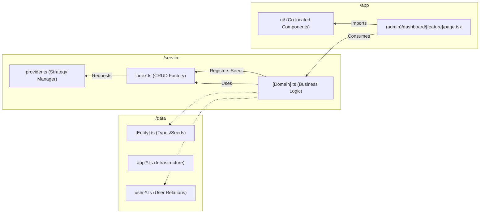
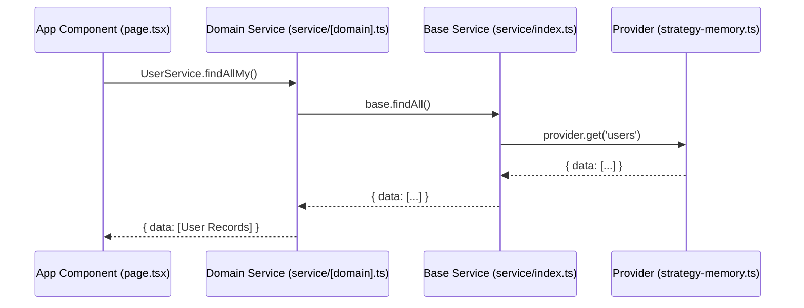

# OpenDND Framework: Architectural Diagrams

## 1. Modular Dependency Graph
The relationship between files in the architecture.

## 2. Data Flow Architecture
How a user interaction reaches the data store.

---
*Generated by OpenDND Framework Visualization Tools.*
