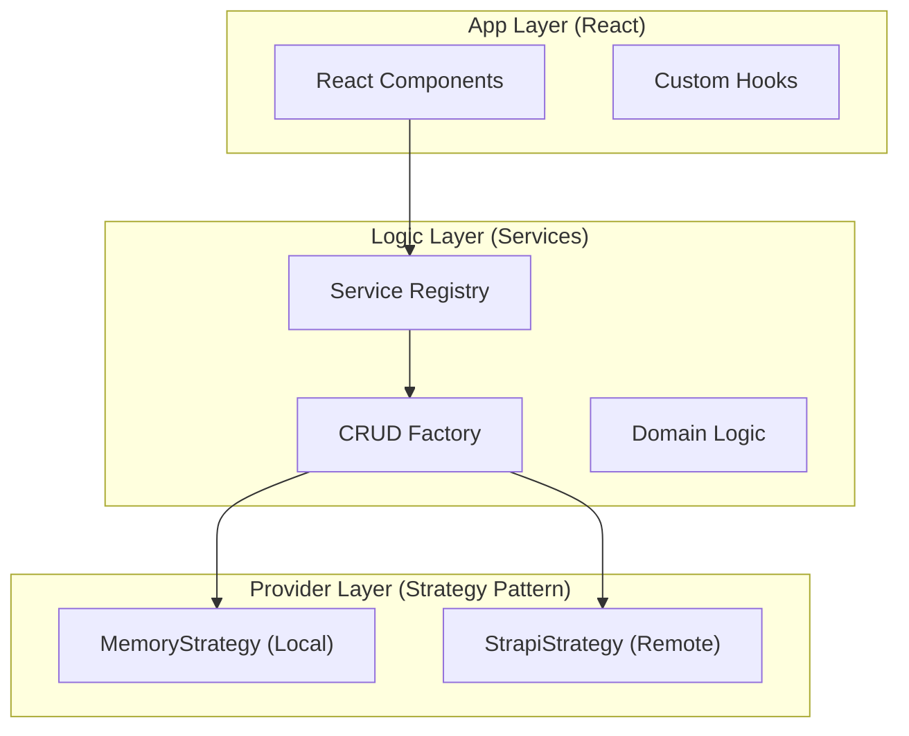
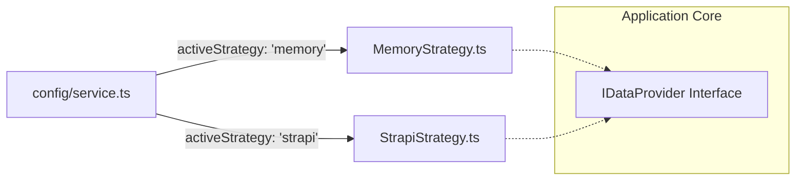
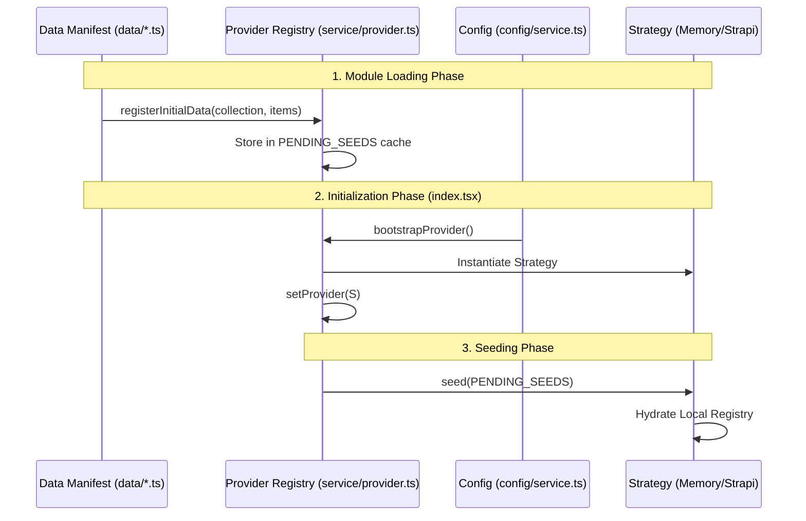
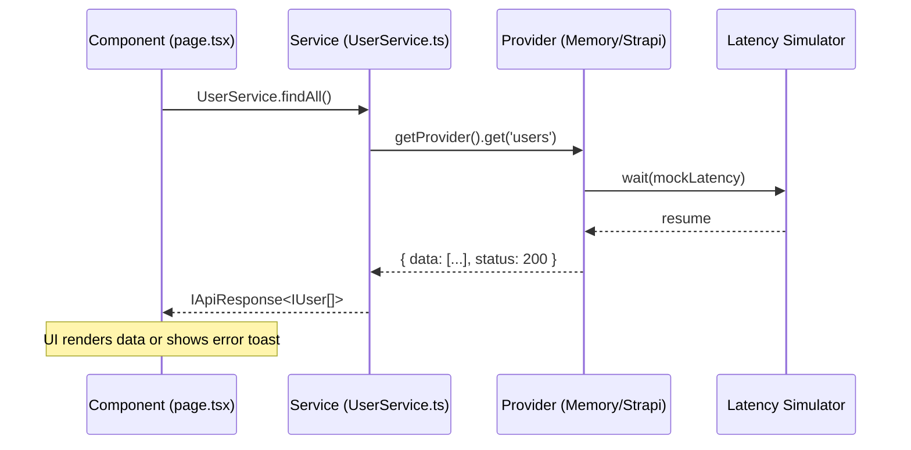
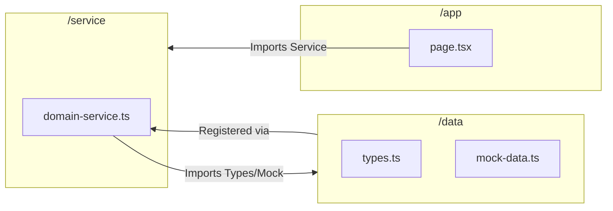

# OpenDND Framework: Architectural Diagrams

This document provides a visual representation of the OpenDND Service-Driven Architecture. Use these diagrams to understand the flow of data and the decoupling of the UI from the backend.

---

## 1. High-Level System Overview
The framework is divided into three distinct layers. Components in the **UI Layer** never touch the **Data Layer** directly; they always communicate via the **Service Layer**.

---

## 2. The Master Switch: Strategy Swapping
By modifying `config/service.ts`, the entire application's data backbone is rewired without changing a single line of UI code.

---

## 3. Bootstrapping & Deferred Seeding
This diagram explains how the framework handles "Race Conditions" where data is registered before the Provider is ready.

---

## 4. Request Lifecycle: Service.findAll()
How a single data request moves through the system and returns a standardized `IApiResponse`.

---

## 5. Modular Dependency Graph
The relationship between files in a feature "pod."

---
*Generated by OpenDND Framework Visualization Tools.*